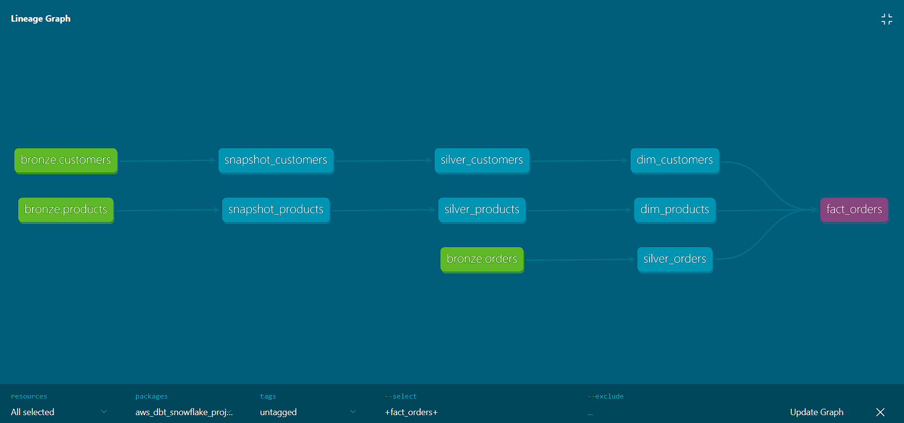

# 🚀 AWS + Snowflake + dbt Data Pipeline Project

## 📌 Project Overview

This project demonstrates an end-to-end **modern ELT pipeline** using **AWS S3**, **Snowflake**, and **dbt** to transform raw data into a clean, scalable **star schema** for analytics.

The pipeline follows a **multi-layered architecture (Bronze → Silver → Gold)** and incorporates industry best practices such as:

* Incremental data loading
* SCD Type 2 using dbt snapshots
* Surrogate keys for joins
* Data quality testing

---

## 🏗️ Architecture

```
AWS S3 (Raw Data)
        ↓
Snowflake (Bronze Layer)
        ↓
dbt Transformations (Silver Layer)
        ↓
Star Schema (Gold Layer)
```

---

## 🔄 Data Lineage



---

## 📂 Data Sources

Raw data stored in AWS S3:

* `orders.csv`
* `customers.csv`
* `products.csv`

---

## ⚙️ Tech Stack

* **AWS S3** – Data storage
* **Snowflake** – Cloud Data Warehouse
* **dbt (Data Build Tool)** – Transformations & modeling
* **SQL** – Data transformations
* **GitHub** – Version control

---

## 🧱 Data Modeling Approach

### 🔹 Bronze Layer (Raw)

* Data ingested from S3 into Snowflake
* No transformations applied

---

### 🔹 Silver Layer (Transformed)

* Data cleaning and standardization
* Incremental models for performance optimization
* Business logic applied using dbt

---

### 🔹 Gold Layer (Star Schema)

#### 📊 Fact Table: `fact_orders`

* order_id
* customer_key (FK)
* product_key (FK)
* quantity
* unit_price
* discount_amount
* total_amount
* status

#### 📐 Dimension Tables

**dim_customers**

* customer_key (Surrogate Key)
* customer_id (Business Key)
* first_name
* last_name
* email
* region
* customer_segment
* created_at
* valid_from
* valid_to

**dim_products**

* product_key (Surrogate Key)
* product_id
* product_name
* unit_price
* category
* supplier_id
* sub_category
* status
* valid_from
* valid_to

---

## 🔑 Key Concepts Implemented

### 🟢 Incremental Models

* Loads only new or updated records
* Improves performance and reduces compute cost

---

## 🔄 Snapshots

Used dbt snapshots to track changes in customer and product data over time.

* Strategy: check
* Tracks historical changes automatically

---

### 🔗 Surrogate Keys

* Generated unique keys for dimension tables
* Used to join fact and dimension tables efficiently

---

## ✅ Data Quality Checks

Implemented dbt tests to ensure reliability:

* **unique** → ensures no duplicate primary keys
* **not_null** → ensures critical fields are never empty

Example:

```yaml
models:
  - name: dim_customers
    columns:
      - name: customer_key
        tests:
          - unique
          - not_null
```

---

## 📁 Project Structure

```
.
├── models/
│   ├── bronze/
│   ├── silver/
│   ├── gold/
├── snapshots/
├── tests/
├── macros/
├── analyses/
├── seeds/
├── dbt_project.yml
├── profiles.yml
├── packages.yml
├── package-lock.yml
├── user.yml
├── .gitignore
```

---

## 🚀 How to Run the Project

### 1️⃣ Clone the Repository

```bash
git clone https://github.com/your-username/aws-dbt-snowflake-project.git
cd aws-dbt-snowflake-project
```

---

### 2️⃣ Configure dbt Profile

Update `profiles.yml` with your Snowflake credentials.

---

### 3️⃣ Run Models

```bash
dbt run
```

---

### 4️⃣ Run Snapshots

```bash
dbt snapshot
```

---

### 5️⃣ Run Tests

```bash
dbt test
```

---

## 📊 Business Use Cases

* Customer behavior analysis
* Product performance tracking
* Revenue insights
* Historical customer tracking (SCD Type 2)

---

## 📈 Future Improvements

* Add orchestration using Airflow
* Build dashboards in Power BI / Tableau
* Implement advanced dbt tests (accepted values)
* Add documentation using dbt docs

---

## 💡 Key Learnings

* Building scalable ELT pipelines
* Implementing star schema modeling
* Using dbt for modular transformations
* Handling historical data with snapshots
* Ensuring data quality with automated tests

---

## 👤 Author
Kshitiz Singh

---

## 📬 Contact

- LinkedIn: https://www.linkedin.com/in/kshitiz-singh-317a9420a/
- Email: kshitizsingh5@gmail.com

---

